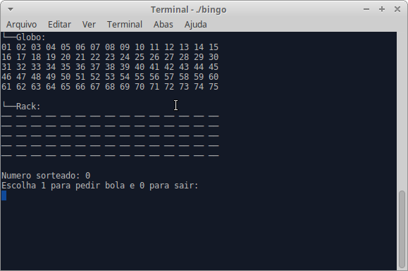

# Bingo

Projeto implementado na disciplina de Fundamentos de Programação da Universidade Federal do Ceará campus Quixadá.



## Criar Executável Bingo

**Executar no terminal:** 

```terminal
gcc bingo.c -o bingo
```

## Iniciar Bingo

**Executar no terminal:** 
```terminal
./bingo
```

## Criar Executável do Gerador de Cartela

**Executar no terminal:** 

```terminal
gcc cartela.c -o cartela
```

## Executar Gerador de Cartela

**Executar no terminal:**
```terminal
./cartela
```